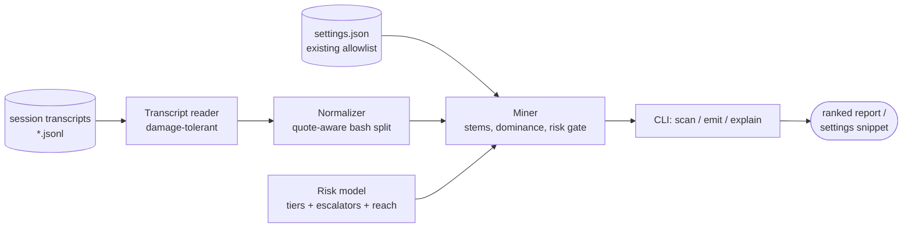

# grantsmith

[English](README.md) | [中文](README.zh.md) | [日本語](README.ja.md)

[](LICENSE) [](CHANGELOG.md) [](pyproject.toml)  [](CONTRIBUTING.md)

**grantsmith：セッション記録を採掘して権限許可リストを鍛造するオープンソースツール — 当てずっぽうやバイパスモードではなく、自分の agent セッションからリスク注釈付きのランク付きルールを。**


```bash
git clone https://github.com/JaydenCJ/grantsmith && cd grantsmith && pip install -e .
```

> **プレリリース：** grantsmith はまだ PyPI に公開されていません。正式リリースまでは [JaydenCJ/grantsmith](https://github.com/JaydenCJ/grantsmith) をクローンし、リポジトリ直下で `pip install -e .` を実行してください。ランタイム依存ゼロ — 標準ライブラリだけで動きます。

## なぜ grantsmith？

権限確認プロンプトは agent CLI への不満の筆頭ですが、今日の答えは二つだけ：記憶を頼りに許可ルールを手書きするか、バイパスモードで全部許可するか。どちらも当て推量です — 前者は許可不足で作業を中断し続け、後者は `rm -rf` に白紙小切手を渡します。しかし正解はすでにディスクの上にあります：セッション記録には agent が実際に行った全ツール呼び出しが残っています。grantsmith はそれを採掘し、証拠付きのルールを提案し（「`git status` は 3 セッションで 36 回実行」）、リスクゲートでステムごとに完全一致かプレフィックスかを決め — `git commit -m …` × 14 は `Bash(git commit:*)` になり、`git push` が隣にある `git status` は決して `Bash(git:*)` にならない — 全提案に `safe` から `critical` の階層を付け、リスクの高い残りが常に意識的で可視な判断に留まるようにします。ローカルファイルを読んで表示するだけ；外部送信もせず、設定も書き換えません。

|  | grantsmith | 手書きルール | セッション内「常に許可」 | バイパスモード |
|---|---|---|---|---|
| ルールの出どころ | 自分の記録から採掘 | 記憶と推測 | セッション中の単発クリック | なし — 全部許可 |
| 「36 回・3 セッション」という証拠 | あり、ルールごと | なし | なし | 対象外 |
| ルールごとのリスク階層 + 理由 | あり（`safe`→`critical`） | 分析者はあなた自身 | なし | 対象外 |
| 完全一致か `prefix:*` かをデータで判断 | あり、リスクゲート付き | 試行錯誤 | 完全一致のみ | 対象外 |
| 設定が既にカバーする分を把握 | あり、再実行で収束 | なし | なし | 対象外 |
| 誤ったときの被害範囲 | レビュー済みルール 1 件 | ルール 1 件 | ルール 1 件 | マシン全体 |

<sub>「セッション内常に許可」= あるコマンドをそのセッション限りで承認すること。許可はセッションと共に消え、設定には何も残りません。バイパスモード（`--dangerously-skip-permissions` など）は、それを備えるどの agent CLI でも明確に非推奨です。grantsmith の依存数は [pyproject.toml](pyproject.toml) の `dependencies = []` の通りです。</sub>

## 特徴

- **証拠付きのルール** — 各提案はカバーする呼び出し数・セッション数・バリアント数を明示（「`Bash(git commit:*)` — 14 回・3 セッション・14 バリアント」）。採用するのは証拠であって雰囲気ではありません。
- **リスクゲート付き一般化** — プレフィックスの*到達範囲*が観測された最も穏当なコマンドより危険でないときに限り提案；安全な git 証拠の横で `Bash(git:*)` は構造的に提案不可能です。`git push` に到達するからです。
- **決して甘くしないリスクモデル** — 5 階層、約 200 エントリのコマンド表、`rm -rf`・`git push --force`・`sh -c`・`find -exec`・コマンド置換・リダイレクト・資格情報らしきパスへのエスカレータ；未知コマンドは `medium`、解析不能は `high`。
- **複合コマンドを正しく処理** — `git add -A && git status` は引用符を認識してセグメントに分割し、単純コマンド単位で採掘。これこそ権限ルールが適用される粒度です；`CI=1 npm test` は `npm test` と合流します。
- **Bash の先へ** — `Read`/`Edit`/`Write` にはディレクトリパターン（入れ子パターンは上方統合、`.env` の証拠は洗浄されず昇格）、`WebFetch(domain:…)` のグルーピング、MCP ツールには読み取り動詞ヒューリスティック。
- **せがむのではなく収束する** — `--settings` で許可リストを指定：カバー済みの呼び出しは「already allowed」として計上され、提案を採用すれば次のスキャンにはもう何も残りません。
- **設計として表示のみ** — `emit` はスニペット（または完全統合済み設定ファイル）を stdout へ；設定を変えるのは常にあなた自身で、`explain --fail-above` はリスクモデルをルールレビューの CI ゲートに変えます。

## クイックスタート

インストールしたら、同梱のサンプルセッション（または自分の記録ディレクトリ）を指定します：

```bash
git clone https://github.com/JaydenCJ/grantsmith && cd grantsmith && pip install -e .
grantsmith scan examples/transcripts
```

実際に取得した出力（中間行は `…` で省略）：

```text
grantsmith — mined 229 tool calls from 3 transcripts (3 sessions, 2026-06-30 → 2026-07-11)

  tool calls seen            229
  bash segments              158
  already allowed              0
  candidate rules             19

   #  RULE                                RISK      CALLS  SESSIONS  NOTE
   1  Bash(git status)                    safe         36         3
   2  Read(src/**)                        safe         23         3  covers 7 files
   3  Bash(npm test)                      low          23         3
   4  Bash(npm run:*)                     low          21         3  covers 4 variants
   5  Bash(git diff)                      safe         18         3
   6  Bash(pytest:*)                      low          15         3  covers 4 variants
   7  Bash(git commit:*)                  medium       14         3  covers 14 variants
   …
  16  Bash(npm install)                   medium        3         2

held back above --max-risk medium (3 rules, 13 calls):
      RULE                                          RISK      CALLS  SESSIONS  NOTE
      Bash(git push)                                high          6         3
      Bash(curl -s https://api.example.test/healt…  high          4         3
      Bash(rm -rf node_modules)                     critical      3         2
        Bash(git push) — git push: publishes commits to a remote
        Bash(curl -s https://api.example.test/healt… — curl: network access: can download or exfiltrate
        Bash(rm -rf node_modules) — rm: deletes files; recursive force delete (`rm -rf`)

Next: `grantsmith emit …` prints these 16 rules as a settings snippet.
```

納得できるルールをマージ可能な設定スニペットとして出力するか、任意のルールを問い詰めます：

```bash
grantsmith emit examples/transcripts --max-risk low   # snippet on stdout
grantsmith explain "Bash(git:*)"                      # risk: high — reaches `git push`
```

自分のマシンでは、agent CLI の記録ディレクトリ（例：`~/.claude/projects/`）に `scan` を向け、既存の許可を計上するため `--settings .claude/settings.json` を付けます。何も書き込まれません：スニペットを貼り付けて採用するか、`emit --merge` の出力を自分でリダイレクトしてください。

## リスク階層

| 階層 | 意味 | 例 |
|---|---|---|
| `safe` | 読み取り専用、副作用なし | `git status`、`Grep`、`Read(src/**)` |
| `low` | プロジェクト内で影響が限定的 | `npm test`、`pytest:*`、`WebSearch` |
| `medium` | ローカルを変更 / 正直な不確実性 | `git commit:*`、`Edit(src/**)`、未知のコマンド |
| `high` | リモート・破壊的・資格情報に近い | `git push`、`curl`、`rm`、`Read(~/.ssh/**)` |
| `critical` | 不可逆または権限昇格 | `sudo`、`rm -rf`、`git push --force`、`sh -c` |

`scan` と `emit` は `--max-risk` 予算（既定 `medium`）を共有：予算超過のルールはモデルの理由と共に保留セクションに表示され、黙って捨てられることはありません。モデルの全容 — コマンド表・エスカレータ・プレフィックス到達範囲・一般化ゲート — は [`docs/rule-mining.md`](docs/rule-mining.md) に厳密に規定されています。

## オプション

証拠系のつまみは `scan` と `emit` で共有され、両者の数字は常に一致します：

| キー | 既定値 | 効果 |
|---|---|---|
| `--min-count N` | `3` | 証拠の閾値：ルールには N 回のカバーが必要 |
| `--max-risk TIER` | `medium` | 予算：TIER 以下のルールだけを提案/出力 |
| `--settings FILE` | なし | 既存の許可リスト；カバー済みの呼び出しは再提案しない |
| `--top N` | `20` | `scan`：最大 N 件のルールを表示 |
| `--json` | オフ | `scan`/`explain`：機械可読な出力 |
| `--merge` | オフ | `emit`：新ルールを追記した完全な `--settings` ファイルを表示 |
| `--fail-above TIER` | なし | `explain`：評価が TIER より悪ければ終了コード 1 |

## 検証

このリポジトリに CI はありません；上記の主張はすべてローカル実行で検証しています。このリポジトリのチェックアウトから再現できます：

```bash
pip install -e '.[dev]' && pytest && bash scripts/smoke.sh
```

出力（実際の実行から転記、`...` で省略）：

```text
92 passed in 0.73s
...
[scan] grantsmith — mined 229 tool calls from 3 transcripts (3 sessions, 2026-06-30 → 2026-07-11)
SMOKE OK
```

## アーキテクチャ



## ロードマップ

- [x] 記録の採掘、リスクゲート付き一般化、5 階層リスクモデル、scan/emit/explain CLI（v0.1.0）
- [ ] PyPI へ公開し `pip install grantsmith` に対応
- [ ] `deny` 提案：繰り返す高リスクパターンへの明示的拒否ルール
- [ ] 新しさの重み付けで先月のワークフローを昨年より優先
- [ ] プロジェクト設定とユーザー設定の区別（提案を正しいファイルへ）
- [ ] Windows シェル（PowerShell/cmd）分割による Windows ホスト由来の Bash 記録対応

全リストは [open issues](https://github.com/JaydenCJ/grantsmith/issues) をご覧ください。

## コントリビュート

コントリビュート歓迎 — [good first issue](https://github.com/JaydenCJ/grantsmith/issues?q=is%3Aissue+is%3Aopen+label%3A%22good+first+issue%22) から始めるか、[discussion](https://github.com/JaydenCJ/grantsmith/discussions) を立ててください。開発環境の構築は [CONTRIBUTING.md](CONTRIBUTING.md) を参照。

## ライセンス

[MIT](LICENSE)
