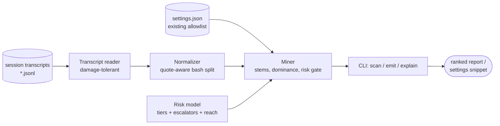

# grantsmith

[English](README.md) | [中文](README.zh.md) | [日本語](README.ja.md)

[](LICENSE) [](CHANGELOG.md) [](pyproject.toml)  [](CONTRIBUTING.md)

**grantsmith：an open-source transcript miner that forges permission allowlists from evidence — ranked rules with risk annotations, from your own agent sessions instead of guesswork or bypass modes.**


```bash
git clone https://github.com/JaydenCJ/grantsmith && cd grantsmith && pip install -e .
```

> **Pre-release:** grantsmith is not yet published to PyPI. Until the first release, clone [JaydenCJ/grantsmith](https://github.com/JaydenCJ/grantsmith) and run `pip install -e .` from the repository root. Zero runtime dependencies — the standard library is all it needs.

## Why grantsmith?

Permission prompts are the top complaint about agent CLIs, and today there are exactly two answers: hand-write allowlist rules from memory, or flip on a bypass mode and grant everything. Both are guesses — one under-grants and keeps interrupting you, the other hands `rm -rf` a blank check. Yet the correct answer already sits on your disk: session transcripts record every tool call your agent actually made. grantsmith mines them and proposes rules backed by receipts ("`git status` ran 36 times across 3 sessions"), decides exact-vs-prefix per stem with a risk gate — `git commit -m …` × 14 becomes `Bash(git commit:*)`, while `git status` next to `git push` never becomes `Bash(git:*)` — and tiers every proposal from `safe` to `critical` so the risky residue stays a conscious, visible decision. It reads local files and prints; it never phones home and never edits your settings.

|  | grantsmith | hand-written rules | session "always allow" | bypass mode |
|---|---|---|---|---|
| Where rules come from | mined from your transcripts | memory and guesswork | one-off clicks mid-session | none — everything allowed |
| "This ran 36×, 3 sessions" evidence | Yes, per rule | No | No | n/a |
| Risk tier + reasons per rule | Yes (`safe`→`critical`) | you are the analysis | No | n/a |
| Exact vs `prefix:*` decided by data | Yes, risk-gated | trial and error | exact only | n/a |
| Sees what settings already cover | Yes, converges on re-run | No | No | n/a |
| Blast radius when wrong | one reviewed rule | one rule | one rule | the whole machine |

<sub>"Session always allow" = approving a command for the rest of one session; the grant dies with the session and teaches your settings nothing. Bypass modes (`--dangerously-skip-permissions` and equivalents) are explicitly discouraged by every agent CLI that ships one. grantsmith's dependency count is `dependencies = []` in [pyproject.toml](pyproject.toml).</sub>

## Features

- **Rules with receipts** — every proposal cites calls covered, distinct sessions, and variants ("`Bash(git commit:*)` — 14 calls, 3 sessions, 14 variants"), so you adopt evidence, not vibes.
- **Risk-gated generalization** — a prefix rule is proposed only when its *reach* is no riskier than the mildest command observed under it; `Bash(git:*)` is structurally impossible to propose next to safe-only git evidence because it reaches `git push`.
- **A risk model that never flatters** — five tiers, a ~200-entry command table, and escalators for `rm -rf`, `git push --force`, `sh -c`, `find -exec`, command substitution, redirection, credential-looking paths; unknown commands score `medium`, unparseable ones `high`.
- **Compound commands done right** — `git add -A && git status` is split quote-aware into segments and mined per simple command, exactly the granularity permission rules apply at; `CI=1 npm test` merges with `npm test`.
- **Beyond Bash** — directory patterns for `Read`/`Edit`/`Write` (nested patterns merge upward, `.env` evidence escalates instead of being laundered), `WebFetch(domain:…)` grouping, MCP tools with a read-verb heuristic.
- **Converges instead of nagging** — point `--settings` at your allowlist: covered calls are counted as "already allowed", and once you adopt the proposals a re-scan has nothing left to say.
- **Print-only by design** — `emit` writes a snippet (or a fully merged settings file) to stdout; your settings are only ever changed by you, and `explain --fail-above` turns the risk model into a CI gate for rule reviews.

## Quickstart

Install, then point it at the bundled sample sessions (or your own transcript directory):

```bash
git clone https://github.com/JaydenCJ/grantsmith && cd grantsmith && pip install -e .
grantsmith scan examples/transcripts
```

Real captured output (middle rows elided with `…`):

```text
grantsmith — mined 229 tool calls from 3 transcripts (3 sessions, 2026-06-30 → 2026-07-11)

  tool calls seen            229
  bash segments              158
  already allowed              0
  candidate rules             19

   #  RULE                                RISK      CALLS  SESSIONS  NOTE
   1  Bash(git status)                    safe         36         3
   2  Read(src/**)                        safe         23         3  covers 7 files
   3  Bash(npm test)                      low          23         3
   4  Bash(npm run:*)                     low          21         3  covers 4 variants
   5  Bash(git diff)                      safe         18         3
   6  Bash(pytest:*)                      low          15         3  covers 4 variants
   7  Bash(git commit:*)                  medium       14         3  covers 14 variants
   …
  16  Bash(npm install)                   medium        3         2

held back above --max-risk medium (3 rules, 13 calls):
      RULE                                          RISK      CALLS  SESSIONS  NOTE
      Bash(git push)                                high          6         3
      Bash(curl -s https://api.example.test/healt…  high          4         3
      Bash(rm -rf node_modules)                     critical      3         2
        Bash(git push) — git push: publishes commits to a remote
        Bash(curl -s https://api.example.test/healt… — curl: network access: can download or exfiltrate
        Bash(rm -rf node_modules) — rm: deletes files; recursive force delete (`rm -rf`)

Next: `grantsmith emit …` prints these 16 rules as a settings snippet.
```

Emit the rules you are comfortable with as a mergeable settings snippet, or interrogate any rule:

```bash
grantsmith emit examples/transcripts --max-risk low   # snippet on stdout
grantsmith explain "Bash(git:*)"                      # risk: high — reaches `git push`
```

On your own machine, point `scan` at your agent CLI's transcript directory (e.g. `~/.claude/projects/`) and add `--settings .claude/settings.json` so it accounts for what you already allow. Nothing is written anywhere: adopt rules by pasting the snippet, or redirect `emit --merge` output yourself.

## Risk tiers

| Tier | Meaning | Examples |
|---|---|---|
| `safe` | read-only, no side effects | `git status`, `Grep`, `Read(src/**)` |
| `low` | project-scoped, contained effects | `npm test`, `pytest:*`, `WebSearch` |
| `medium` | mutates locally / honest uncertainty | `git commit:*`, `Edit(src/**)`, unknown commands |
| `high` | remote, destructive, or credential-adjacent | `git push`, `curl`, `rm`, `Read(~/.ssh/**)` |
| `critical` | irreversible or privilege-escalating | `sudo`, `rm -rf`, `git push --force`, `sh -c` |

`scan` and `emit` share a `--max-risk` budget (default `medium`): rules above it are shown in a held-back section with the model's reasons, never silently dropped. The full model — table, escalators, prefix reach, and the generalization gate — is specified in [`docs/rule-mining.md`](docs/rule-mining.md).

## Options

All evidence knobs are shared by `scan` and `emit`, so their numbers always agree:

| Key | Default | Effect |
|---|---|---|
| `--min-count N` | `3` | evidence threshold: a rule needs N covered calls |
| `--max-risk TIER` | `medium` | budget: propose/emit only rules at or below TIER |
| `--settings FILE` | none | existing allowlist; covered calls are not re-proposed |
| `--top N` | `20` | `scan`: show at most N rules |
| `--json` | off | `scan`/`explain`: machine-readable output |
| `--merge` | off | `emit`: print the full `--settings` file with new rules appended |
| `--fail-above TIER` | none | `explain`: exit 1 if the rule scores worse than TIER |

## Verification

This repository ships no CI; every claim above is verified by local runs. Reproduce them from a checkout of this repository:

```bash
pip install -e '.[dev]' && pytest && bash scripts/smoke.sh
```

Output (copied from a real run, truncated with `...`):

```text
92 passed in 0.73s
...
[scan] grantsmith — mined 229 tool calls from 3 transcripts (3 sessions, 2026-06-30 → 2026-07-11)
SMOKE OK
```

## Architecture



## Roadmap

- [x] Transcript mining, risk-gated generalization, five-tier risk model, scan/emit/explain CLI (v0.1.0)
- [ ] PyPI release with `pip install grantsmith`
- [ ] `deny` suggestions: propose explicit deny rules for repeated high-risk patterns
- [ ] Recency weighting so last month's workflow outranks last year's
- [ ] Per-project vs user-level settings awareness (propose to the right file)
- [ ] Windows shell (PowerShell/cmd) segmentation for Bash-tool transcripts from Windows hosts

See the [open issues](https://github.com/JaydenCJ/grantsmith/issues) for the full list.

## Contributing

Contributions are welcome — start with a [good first issue](https://github.com/JaydenCJ/grantsmith/issues?q=is%3Aissue+is%3Aopen+label%3A%22good+first+issue%22) or open a [discussion](https://github.com/JaydenCJ/grantsmith/discussions). See [CONTRIBUTING.md](CONTRIBUTING.md) for the development setup.

## License

[MIT](LICENSE)
