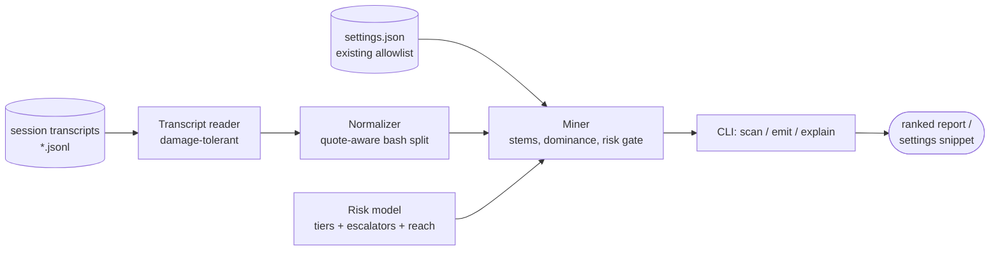

# grantsmith

[English](README.md) | [中文](README.zh.md) | [日本語](README.ja.md)

[](LICENSE) [](CHANGELOG.md) [](pyproject.toml)  [](CONTRIBUTING.md)

**grantsmith：一个开源的会话记录挖掘器，用证据锻造权限白名单 — 从你自己的 agent 会话中提炼出带风险标注的排序规则，告别拍脑袋和一键放行。**


```bash
git clone https://github.com/JaydenCJ/grantsmith && cd grantsmith && pip install -e .
```

> **预发布：** grantsmith 尚未发布到 PyPI。正式发布前，请克隆 [JaydenCJ/grantsmith](https://github.com/JaydenCJ/grantsmith) 并在仓库根目录执行 `pip install -e .`。零运行时依赖 — 只需要标准库。

## 为什么选 grantsmith？

权限确认弹窗是 agent CLI 被抱怨最多的问题，而今天只有两种答案：凭记忆手写白名单规则，或者打开旁路模式放行一切。两者都是猜测 — 一个授权不足、不停打断你，另一个给 `rm -rf` 开了空白支票。而正确答案其实早就躺在你的磁盘上：会话记录保存了 agent 实际执行的每一次工具调用。grantsmith 挖掘这些记录，提出有凭有据的规则（"`git status` 在 3 个会话中运行了 36 次"），用风险闸门为每个词干决定精确还是前缀 — `git commit -m …` × 14 变成 `Bash(git commit:*)`，而 `git status` 与 `git push` 相邻时绝不会变成 `Bash(git:*)` — 并给每条提案标注 `safe` 到 `critical` 的风险层级，让高风险的残留始终是一个清醒、可见的决定。它只读取本地文件并打印；从不联网上报，也从不改写你的设置。

|  | grantsmith | 手写规则 | 会话内"总是允许" | 旁路模式 |
|---|---|---|---|---|
| 规则从哪来 | 从你的会话记录中挖掘 | 记忆和猜测 | 会话中的一次性点击 | 无 — 全部放行 |
| "运行了 36 次、3 个会话"的证据 | 有，逐条规则 | 无 | 无 | 不适用 |
| 每条规则的风险层级 + 理由 | 有（`safe`→`critical`） | 你自己就是分析器 | 无 | 不适用 |
| 精确还是 `prefix:*` 由数据决定 | 是，经风险闸门 | 反复试错 | 只有精确 | 不适用 |
| 感知设置里已覆盖的内容 | 是，重跑即收敛 | 否 | 否 | 不适用 |
| 出错时的爆炸半径 | 一条经过审阅的规则 | 一条规则 | 一条规则 | 整台机器 |

<sub>"会话内总是允许" = 在单个会话内批准某条命令；授权随会话消亡，对你的设置毫无沉淀。旁路模式（`--dangerously-skip-permissions` 及同类）被每一个提供它的 agent CLI 明确不推荐。grantsmith 的依赖数即 [pyproject.toml](pyproject.toml) 中的 `dependencies = []`。</sub>

## 特性

- **有凭据的规则** — 每条提案都列出覆盖的调用数、会话数与变体数（"`Bash(git commit:*)` — 14 次调用、3 个会话、14 种变体"），你采纳的是证据，不是感觉。
- **风险闸门约束泛化** — 只有当前缀的*可达范围*不比其下观察到的最温和命令更危险时，才会提出前缀规则；在只有安全 git 证据的旁边，`Bash(git:*)` 在结构上就不可能被提出，因为它可达 `git push`。
- **从不美化的风险模型** — 五个层级、约 200 条命令表，以及针对 `rm -rf`、`git push --force`、`sh -c`、`find -exec`、命令替换、重定向、疑似凭证路径的升级器；未知命令记 `medium`，无法解析的记 `high`。
- **正确处理复合命令** — `git add -A && git status` 按引号感知的方式切分成段并逐条简单命令挖掘，正是权限规则生效的粒度；`CI=1 npm test` 会与 `npm test` 合并。
- **不止 Bash** — 为 `Read`/`Edit`/`Write` 生成目录模式（嵌套模式向上合并，`.env` 证据会升级而不是被洗白）、按 `WebFetch(domain:…)` 分组、MCP 工具采用读动词启发式。
- **收敛而不是唠叨** — 用 `--settings` 指向你的白名单：已覆盖的调用计入"already allowed"，采纳提案之后再扫一次就再无可提。
- **设计上只打印** — `emit` 将片段（或完整合并后的设置文件）写到 stdout；你的设置永远只由你自己改动，而 `explain --fail-above` 能把风险模型变成规则评审的 CI 闸门。

## 快速上手

安装后，指向内置的示例会话（或你自己的记录目录）：

```bash
git clone https://github.com/JaydenCJ/grantsmith && cd grantsmith && pip install -e .
grantsmith scan examples/transcripts
```

真实捕获的输出（中间行以 `…` 省略）：

```text
grantsmith — mined 229 tool calls from 3 transcripts (3 sessions, 2026-06-30 → 2026-07-11)

  tool calls seen            229
  bash segments              158
  already allowed              0
  candidate rules             19

   #  RULE                                RISK      CALLS  SESSIONS  NOTE
   1  Bash(git status)                    safe         36         3
   2  Read(src/**)                        safe         23         3  covers 7 files
   3  Bash(npm test)                      low          23         3
   4  Bash(npm run:*)                     low          21         3  covers 4 variants
   5  Bash(git diff)                      safe         18         3
   6  Bash(pytest:*)                      low          15         3  covers 4 variants
   7  Bash(git commit:*)                  medium       14         3  covers 14 variants
   …
  16  Bash(npm install)                   medium        3         2

held back above --max-risk medium (3 rules, 13 calls):
      RULE                                          RISK      CALLS  SESSIONS  NOTE
      Bash(git push)                                high          6         3
      Bash(curl -s https://api.example.test/healt…  high          4         3
      Bash(rm -rf node_modules)                     critical      3         2
        Bash(git push) — git push: publishes commits to a remote
        Bash(curl -s https://api.example.test/healt… — curl: network access: can download or exfiltrate
        Bash(rm -rf node_modules) — rm: deletes files; recursive force delete (`rm -rf`)

Next: `grantsmith emit …` prints these 16 rules as a settings snippet.
```

把你放心的规则输出为可合并的设置片段，或审问任何一条规则：

```bash
grantsmith emit examples/transcripts --max-risk low   # snippet on stdout
grantsmith explain "Bash(git:*)"                      # risk: high — reaches `git push`
```

在自己的机器上，把 `scan` 指向 agent CLI 的记录目录（例如 `~/.claude/projects/`），并加上 `--settings .claude/settings.json` 以计入已有授权。任何文件都不会被写入：粘贴片段来采纳规则，或自行重定向 `emit --merge` 的输出。

## 风险层级

| 层级 | 含义 | 示例 |
|---|---|---|
| `safe` | 只读，无副作用 | `git status`、`Grep`、`Read(src/**)` |
| `low` | 限于项目范围、影响可控 | `npm test`、`pytest:*`、`WebSearch` |
| `medium` | 本地改动 / 诚实的不确定 | `git commit:*`、`Edit(src/**)`、未知命令 |
| `high` | 远程、破坏性或触及凭证 | `git push`、`curl`、`rm`、`Read(~/.ssh/**)` |
| `critical` | 不可逆或提权 | `sudo`、`rm -rf`、`git push --force`、`sh -c` |

`scan` 与 `emit` 共用 `--max-risk` 预算（默认 `medium`）：超出预算的规则会连同模型的理由显示在保留区，绝不静默丢弃。完整模型 — 命令表、升级器、前缀可达范围与泛化闸门 — 精确定义在 [`docs/rule-mining.md`](docs/rule-mining.md)。

## 选项

证据相关旋钮由 `scan` 和 `emit` 共享，两者的数字因此永远一致：

| 键 | 默认值 | 效果 |
|---|---|---|
| `--min-count N` | `3` | 证据门槛：一条规则需要覆盖 N 次调用 |
| `--max-risk TIER` | `medium` | 预算：只提出/输出不超过 TIER 的规则 |
| `--settings FILE` | 无 | 已有白名单；已覆盖的调用不再重复提出 |
| `--top N` | `20` | `scan`：最多显示 N 条规则 |
| `--json` | 关 | `scan`/`explain`：机器可读输出 |
| `--merge` | 关 | `emit`：打印追加新规则后的完整 `--settings` 文件 |
| `--fail-above TIER` | 无 | `explain`：若规则评级劣于 TIER 则以 1 退出 |

## 验证

本仓库不附带 CI；以上所有断言均由本地运行验证。从本仓库的检出中即可复现：

```bash
pip install -e '.[dev]' && pytest && bash scripts/smoke.sh
```

输出（摘自真实运行，以 `...` 截断）：

```text
92 passed in 0.73s
...
[scan] grantsmith — mined 229 tool calls from 3 transcripts (3 sessions, 2026-06-30 → 2026-07-11)
SMOKE OK
```

## 架构



## 路线图

- [x] 会话记录挖掘、风险闸门泛化、五级风险模型、scan/emit/explain CLI（v0.1.0）
- [ ] 发布到 PyPI，支持 `pip install grantsmith`
- [ ] `deny` 建议：为反复出现的高风险模式提出显式拒绝规则
- [ ] 时效加权，让上个月的工作流压过去年的
- [ ] 区分项目级与用户级设置（把提案送到正确的文件）
- [ ] Windows shell（PowerShell/cmd）切分，支持来自 Windows 主机的 Bash 工具记录

完整列表见 [open issues](https://github.com/JaydenCJ/grantsmith/issues)。

## 贡献

欢迎贡献 — 从一个 [good first issue](https://github.com/JaydenCJ/grantsmith/issues?q=is%3Aissue+is%3Aopen+label%3A%22good+first+issue%22) 开始，或发起一个 [discussion](https://github.com/JaydenCJ/grantsmith/discussions)。开发环境搭建见 [CONTRIBUTING.md](CONTRIBUTING.md)。

## 许可证

[MIT](LICENSE)
